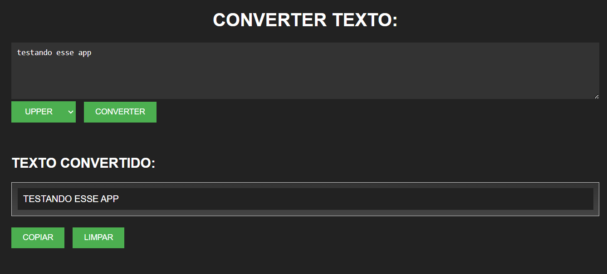

# CONVERTER PARA UPPER VOLUME 1
🐱‍👤USE O JAVASCRIPT PARA TRANSFORMAR SEU TEXTO EM UPPER, LOWER OU MISTO.

  

## DESCRIÇÃO:
O objetivo deste projeto é oferecer uma ferramenta prática para converter texto em letras maiúsculas, minusculas ou misturado. Aqui estão as principais funcionalidades implementadas:
- **Entrada de texto**: Os usuários podem digitar ou colar o texto desejado em uma caixa de texto.
- **Conversão para maiúsculas**: Ao clicar no botão "UPPER", o texto inserido na primeira área é convertido para letras maiúsculas.
- **Conversão para minúsculas**: Ao clicar no botão "LOWER", o texto inserido na primeira área é convertido para letras minúsculas.
- **Conversão mista**: Ao clicar no botão "MISTO", o texto inserido na primeira área tem a primeira letra de cada palavra convertida para maiúscula.
- **Limpeza do texto**: O botão "Limpar" permite que os usuários apaguem o conteúdo da caixa de texto.
- **Exibição do texto convertido**: O texto convertido em letras maiúsculas é exibido em uma área específica abaixo da caixa de texto.
- **Cópia do texto convertido**: O botão "Copiar Texto" copia o texto convertido para a área de transferência, permitindo que os usuários o cole em outro lugar.

## NÃO SABE?
- Entendemos que para manipular arquivos em `HTML`, `CSS` e outras linguagens relacionadas, é necessário possuir conhecimento nessas áreas. Para auxiliar nesse aprendizado, oferecemos cursos gratuitos disponíveis:
* [CURSO DE HTML E CSS](https://github.com/VILHALVA/CURSO-DE-HTML-E-CSS)
* [CURSO DE JAVASCRIPT](https://github.com/VILHALVA/CURSO-DE-JAVASCRIPT)
* [CONFIRA MAIS CURSOS](https://github.com/VILHALVA?tab=repositories&q=+topic:CURSO)

## CREDITOS:
- [PROJETO CRIADO PELO VILHALVA](https://github.com/VILHALVA)
- [ESTÁ DISPONIVEL NO SITE](https://vilhalva.github.io/STYLER/STYLER.html)