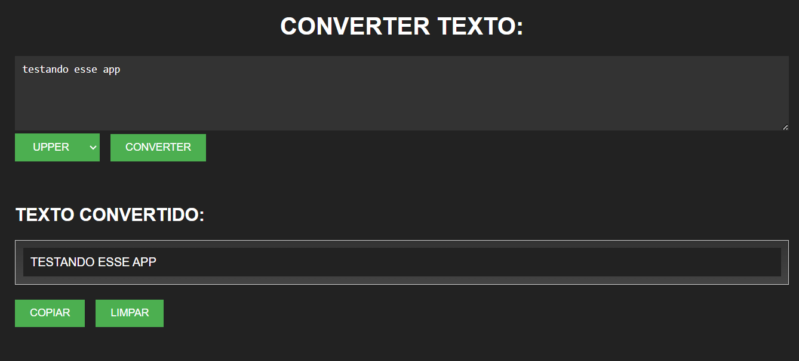

# PROJETO-TEXTO-UPPER
🐱‍👤USE O JAVASCRIPT PARA TRANSFORMAR SEU TEXTO EM UPPER.

 
  

  

## 🎏DESCRIÇÃO:
Bem-vindo ao projeto "Conversor de Texto"! Este repositório contém uma implementação simples de um conversor de texto em HTML, CSS e JavaScript. O projeto permite que os usuários convertam o texto digitado para letras maiúsculas.

### 🎉Funcionalidades:
O objetivo deste projeto é oferecer uma ferramenta prática para converter texto em letras maiúsculas. Aqui estão as principais funcionalidades implementadas:
- **Entrada de texto**: Os usuários podem digitar ou colar o texto desejado em uma caixa de texto.
- **Conversão para maiúsculas**: Ao clicar no botão "Converter para maiúsculas", o texto inserido é convertido para letras maiúsculas.
- **Limpeza do texto**: O botão "Limpar" permite que os usuários apaguem o conteúdo da caixa de texto.
- **Exibição do texto convertido**: O texto convertido em letras maiúsculas é exibido em uma área específica abaixo da caixa de texto.
- **Cópia do texto convertido**: O botão "Copiar Texto" copia o texto convertido para a área de transferência, permitindo que os usuários o cole em outro lugar.

### 🧨Como usar o Projeto Conversor de Texto?
Para usar o conversor de texto em seu navegador, siga estas etapas simples:
1. Clone este repositório em sua máquina local ou faça o download dos arquivos.
2. Abra o arquivo `CONVERSOR.html` em seu navegador de preferência.
3. Uma página será carregada com uma caixa de texto e botões interativos.
4. Digite ou cole o texto desejado na caixa de texto.
5. Clique no botão "Converter para maiúsculas" para converter o texto para letras maiúsculas.
6. O texto convertido será exibido na área abaixo da caixa de texto.
7. Clique no botão "Copiar Texto" para copiar o texto convertido para a área de transferência.
8. Utilize o texto convertido conforme necessário em outros aplicativos ou documentos.
